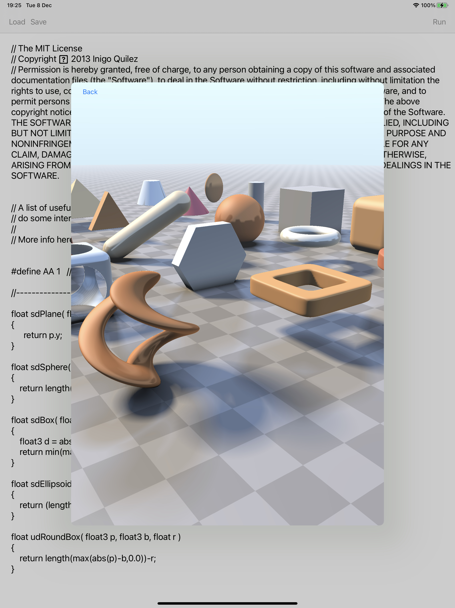

# MetalToy
[ShaderToy](https://www.shadertoy.com) clone for Metal on iOS

Clone the repository and then open the project file and build with XCode.

Some example shaders are provided in the Shaders subfolder.

